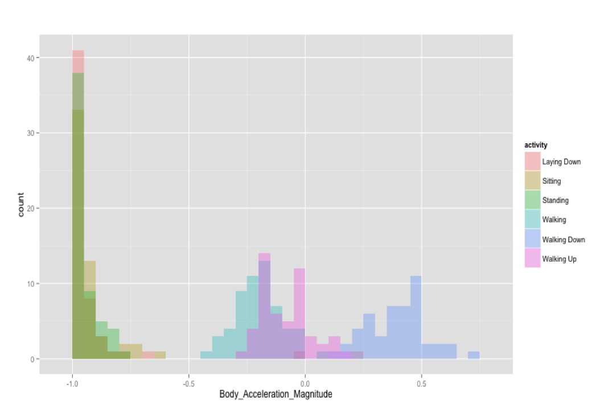

# Introduction
Now we're going to use a large and messy data set from a familiar source object and then prepare it for analysis using Random Forests. Why do we want to use Random Forests? This will become clear very shortly.

We will use a data set of mobile phone accelerometer and gyroscope readings to create a predictive model. The data set is found in R Data form [1] on Amazon S3 and raw form at the UCI Repository [2] The data set readings encode data on mobile phone orientation and motion of the wearer of the phone.

The subject is known to be doing one of six activities - sitting, standing, lying down, walking, walking up, and walking down.

# Methods
Our goal is to predict, given one data point, which activity they are doing. We set ourself a goal of creating a model with understandable variables rather than a black box model. We have the choice of creating a black box model that just has variables and coefficients. When given a data point we feed it to the model and out pops an answer. This generally works but is simply too much "magic" to give us any help in building our intuition or giving us any opportunity to use our domain knowledge.

So we are going to open the box a bit and we are going to use domain knowledge combined with the massive power of Random Forests once we have some intuition going. We find that in the long run this is a much more satisfying approach and also, it appears, a much more powerful one.

We will reduce the independent variable set to 36 variables using domain knowledge alone and then use Random Forests to predict the variable ‘activity’. This may not be the best model from the point of view of accuracy, but we want to understand what is going on and from that perspective it turns out to be much better.

We use accuracy measures Positive and Negative Prediction Value, Sensitivity and Specificity to rate our model.

# Data Cleanup
* The given data set contains activity data for 21 subjects.
* The data set has 7,352 rows with 561 numeric data columns plus 2 columns ‘subject’, an integer, and ‘activity’, a character string.
* Since we have 563 total columns we will dispense with the step of creating a formal data dictionary and refer to feature_info.txt instead
* Initial exploration of the data shows it has dirty column name text with a number of problems:

    * Duplicate column names - multiple occurrences.
    * Inclusion of ( ) in column names.
    * Extra ) in some column names.
    * Inclusion of ‘-’ in column names.
    * Inclusion of multiple ‘,’ in column names
    * Many column names contain “BodyBody” which we assume is a typo.
    
```{r setup, warning=FALSE, include=FALSE}
library(rmarkdown)
library(pander)
library(ggplot2)
library(readr)
```

```{r setup2, warning=FALSE, include=FALSE}
df <- read_csv("./datasets/samsung/samsungdata.csv")
df = data.frame(df)
```

Populating the interactive namespace from numpy and matplotlib

* We change ‘activity’ to be a categorical variable
* We keep ‘subject’ as integer

We want to create an interpretable model rather than use Random Forests as a black box. So we will need to understand our variables and leverage our intuition about them.

To plan the data exploration, the documentation of the data set from the UCI website [2] is very useful and we study it in detail. Especially the file feature_info.txt is very important in understanding our variables. It is, in effect, the data dictionary which we have avoided listing here. Also the explanation for terminology which we use is in feature_info.txt. So going through it in some detail is critical.

# Exercise
Do each of the above data cleanup activities on the data set. i.e.

* Identify and remove duplicate column names - multiple occurrences.
* Identify and fix inclusion of ( ) in column names. How will you fix this?
* Identify and fix extra ) in some column names. How will you fix this?
* Identify and fix Inclusion of ‘-’ in column names. How will you fix this?
* Identify and fix Inclusion of multiple ‘,’ in column names. How will you fix this?
* Identify and fix column names containing “BodyBody”.

## Note to students
The major value of this data set is as follows

It teaches the implicit lesson that

* You can just use blind brute force techniques and get useful results OR
* You can short circuit a lot of that and use domain knowledge. This data set highlights the power you get from domain knowledge.
* It also nudges us out of our comfort zone to seek supporting knowledge from semanticaly adjacent data sources to empower the analysis further.
* This underlines the fact, obvious in restrospect, that you never get the data and all supporting information in a neat bundle.
* You have to clean it up - we learnt that earlier, but we also may have to be willing to expand our knowledge, do a little research to enhance our background expertise.

So this particular data set may seem a little techy but it could easily be in the direction of bio, or finance or mechanics of fractures or sports analytics or whatever - a data scientist should be willing to get hands and mind dirty. The most successful ones are/will be the ones that are willing to be interdisciplinary.

That's the implicit lesson here.

Aside from understanding what each variable represents, we also want to get some technical background about the meaning of each variable.
So we use the Android Developer Reference [3] to educate ourselves about each of the physical parameters that are important. In this way we extend our domain knowledge so that we understand the language of the data - we allow it to come alive and figuratively speak to us and reveal it's secrets. The more we learn about the background context from which the data comes, the better, faster, and deeper our exploration of the data will be.

In this case see that the variables have X, Y, Z prefixes/suffixes and the Android Developer Reference [3] gives us the specific reference frame with which these are measured. They are vector components of jerk and acceleration, the angles are measured with respect to the direction of gravity or more precisely the vector acceleration due to gravity. We use this information and combine it with some intuition about motion, velocity, acceleration etc.

Variable Reduction
So we dig into the variables and make some quick notes.

Before we go further, you'll need to open a file in the dataset directory for the HAR data set. There is a file called feature_info.txt. This file describes each feature, it's physical significance and also describes features that are derived from raw data by doing some averaging, or sampling or some operation that gives a numerical results.

We want to look at

a) all the variable names
b) physical quantities

and take some time to understand these.

Once we spend some time doing all that, we can extract some useful guidelines using physical understanding and common sense.
* In static activities (sit, stand, lie down) motion information will not be very useful.
* In the dynamic activities (3 types of walking) motion will be significant.
* Angle variables will be useful both in differentiating “lie vs stand” and “walk up vs walk down”.
* Acceleration and Jerk variables are important in distinguishing various kinds of motion while filtering out random tremors while static.
* Mag and angle variables contain the same info as (= strongly correlated with) XYZ variables
* We choose to focus on the latter as they are simpler to reason about.
* This is a very important point to understand as it results in elimination of a few hundred variables.
* We ignore the band variables as we have no simple way to interpret the meaning and relate them to physical activities.
* -mean and -std are important, -skewness and -kurtosis may also be hence we include all these.
* We see the usefulness of some of these variables as predictors in Figure 1. which shows some of our exploration and validates our thinking.

{width=250px}

Figure 1. Using a histogram of Body Acceleration Magnitude to evaluate that variable as a predictor of static vs dynamic activities. This is an example of data exploration in support of our heuristic variable selection using domain knowledge.

# Eliminating confounders
In dropping the -X -Y -Z variables (cartesian coordinates) we removed a large number of confounding variables as these have information strongly correlated with Magnitude + Angle (polar coordinates). There may still be some confounding influences but the remaining effects are hard to interpret.

From common sense we see other variables -min, -max, -mad have correlations with mean/std so we drop all these confounders also. The number of variables is now reduced to 37 as below.

Note to reviewers - we do some tedious name mapping to keep the semantics intact since we want to have a "white box" like model. If we don't we can just take the remaining variables and map them to v1, v2 ..... v37. This would be a couple of lines of code and explanation but we would lose a lot of the value we derived from retaining interpretability using domain knowledge. So we soldier on for just one last step and then we are into the happy land of analysis

# Name transformations
To be able to explore the data easily we rename variables and simplify them for readability as follows.

We drop the "Body" and "Mag" wherever they occur as these are common to all our remaining variables. We map ‘mean’ to Mean and ‘std’ to SD

So e.g.

tAccBodyMag-mean -> tAccMean
fAccBodyMag-std -> fAccSD
etc.

# Results
The reduced set of selected variables with transformed names is now (with meaningful groupings):

* tAccMean, tAccSD tJerkMean, tJerkSD
* tGyroMean, tGyroSD tGyroJerkMean, tGyroJerkSD
* fAccMean, fAccSD, fJerkMean, fJerkSD,
* fGyroMean, fGyroSD, fGyroJerkMean, fGyroJerkSD,
* fGyroMeanFreq, fGyroJerkMeanFreq fAccMeanFreq, fJerkMeanFreq
* fAccSkewness, fAccKurtosis, fJerkSkewness, fJerkKurtosis
* fGyroSkewness, fGyroKurtosis fGyroJerkSkewness, fGyroJerkKurtosis
* angleAccGravity, angleJerkGravity angleGyroGravity, angleGyroJerkGravity
* angleXGravity, angleYGravity, angleZGravity
* subject, activity

# Conclusions
Now after all these data cleanup calisthenics we raise our weary heads and notice something pleasantly surprising and positively encouraging.

These variables are primarily magnitudes of acceleration and jerk with their statistics, along with angle variables. This encourages us to think that our approach of focusing on domain knowledge, doing some extra reading and research and using some elementary physical intuition seems to be bearing fruit.

This is a set of variables that is semantically compact, interpretable and relatively easy to reason about.

We can do another round of winnowing down the variables, because we might have a feeling that 37 variables is too many to hold in our mind at one time - and we would be right. But at this point we bring in the heavy artillery and let the modeling software do the work, using Random Forests on this variable set.

# References
[1] \url{https://spark-public.s3.amazonaws.com/dataanalysis/samsungData.rda}

[2] Human Activity Recognition Using Smartphones \url{http://archive.ics.uci.edu/ml/datasets/Human+Activity+Recognition+Using+Smartphones}

[3] Android Developer Reference \url{http://developer.android.com/reference/android/hardware/Sensor.html}

[4] Random Forests \url{http://en.wikipedia.org/wiki/Random_forest}

[5] Code for computation of error measures \url{https://gist.github.com/nborwankar/5131870}

