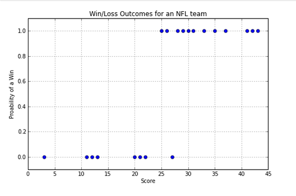
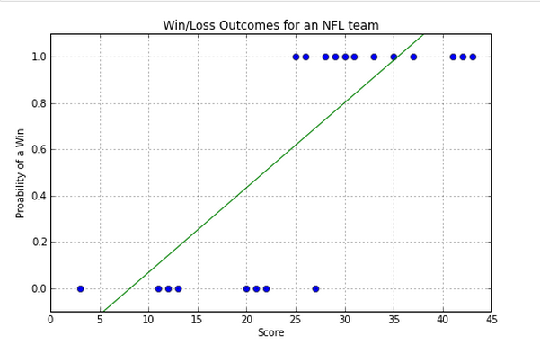
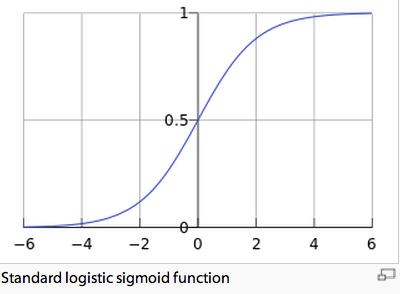

# What are the odds that an event will happen? Answering yes/no questions.
Often we have to resolve questions with binary or yes/no outcomes.

For example:

* Does a patient have cancer?

* Will a team win the next game?

* Will the customer buy my product?

* Will I get the loan?

# A familiar example
We are going to start by plotting something we understand in the real world, although we may never actually have plotted it before. Let's say on the x-axis is the number of goals scored by an NFL team over a season and say the outcome on the y-axis is whether they lost or won the game indicated by a value of 0 or 1 respectively.

Then a plot for these scores might look like this:

{width=250px}

So, how do we predict whether we have a win or a loss if we are given a score?
Clearly linear regression is not a good model.
Take a look at this plot of a "best fit" line over the points:

{width=250px}

# How do we model this sort of data best?

We need a better way to model our data.
We are going to do this in two steps.

First, we will just pull a function out of the data science bag of tricks and show that it works reasonably well.

And, second, we are going to understand how we came up with that function and how it is related to binary outcomes and odds. But before that let's understand this a bit better.

This function will need to have a value of 0 for the loss scores and 1 for the win scores. To make sense it will need to be 0 for some score and all scores below it and be 1 for some other score and all scores above it. And it will need to smoothly increase from 0 to 1 in the intermediate range.

It will need to look something like this:

{width=250px}

# Now for a spot of Math

A function that has the above shape is:

\begin{center} P(x) = $\frac{1}{1+e^{b_{0}+b_{1}x}}$ \end{center}

where P(x) is the probability of a score of x leading to a win.
$b_{0}$, $b_{1}$ are parameters that we will estimate, so the curve fits our data.

Notice that we have a familiar looking linear function,
\begin{center} $b_{0}$ + $b_{1}$x \end{center}

but it's plugged into a formula that generates the shape we want.

So how does this formula predict Yes/No outcomes and why this function of all functions?

# First the "How".

From the shape we can see that that if Score was less than 20 then P(x) would predict a loss, if Score was greater than 30, P(x) would predict a win. But in the middle things would be somewhat fuzzy - we would have even odds when the score was around 25.

So this sort of function is what we use to model binary outcomes.

# Now the "Why".

So why this particular function and how did we derive it as a way to model binary outcomes? We'll defer the gory details the next section on "Odds, Log Odds and the Logit Function", and it will be optional reading.

We need to take a real data set and do some exploration with it. Then we'll do some analysis, as before.

We're going to take the same dataset we used earlier, the Lending Club dataset, but this time we're going to ask a yes/no question:-

## Will I get the loan I want at a favorable interest rate?
